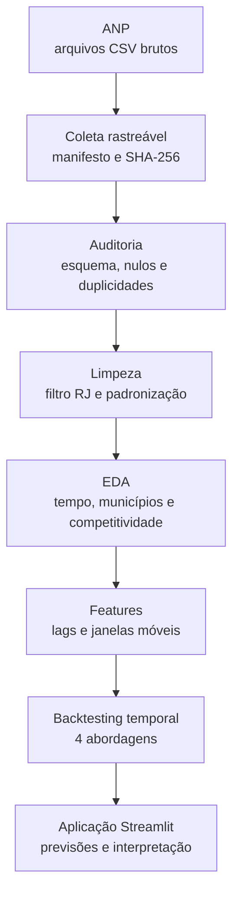

# Fuel Price Intelligence RJ

Pipeline de dados, análise exploratória, engenharia de características, modelagem e aplicação web para monitoramento e previsão semanal dos preços de gasolina comum e etanol no estado do Rio de Janeiro.

[](https://www.python.org/)
[](https://fuel-price-intelligence-rj.streamlit.app/)
[](#testes)
[](LICENSE)

## Aplicação online

Acesse o painel publicado:

**[fuel-price-intelligence-rj.streamlit.app](https://fuel-price-intelligence-rj.streamlit.app/)**

A aplicação apresenta:

- preços semanais mais recentes;
- previsão para a próxima semana;
- histórico interativo;
- competitividade do etanol;
- comparação ajustada entre municípios;
- desempenho dos modelos;
- metodologia e limitações.


## Problema

Preços de combustíveis mudam ao longo do tempo e apresentam diferenças entre municípios, postos e produtos. Uma solução útil precisa fazer mais do que treinar um modelo: ela deve coletar dados reais, preservar sua origem, tratar inconsistências, controlar vazamento temporal, comparar abordagens e comunicar as limitações da previsão.

O projeto responde principalmente:

> Qual deverá ser a mediana estadual do preço da gasolina comum e do etanol na próxima semana?

Também investiga:

- como os preços evoluíram;
- quando o etanol foi competitivo;
- quais municípios ficaram acima ou abaixo da referência estadual;
- quais modelos generalizam melhor para períodos futuros;
- em quais situações a previsão apresenta os maiores erros.

## Resultado principal

O melhor modelo não foi o mais complexo.

O baseline que repete o último preço semanal conhecido superou Regressão Ridge, Random Forest e HistGradientBoosting para os dois produtos.

| Produto | Modelo selecionado | MAE | RMSE | WAPE | Janelas vencidas |
|---|---|---:|---:|---:|---:|
| Etanol | Último preço conhecido | R$ 0,0318 | R$ 0,0506 | 0,68% | 14 de 19 |
| Gasolina | Último preço conhecido | R$ 0,0301 | R$ 0,0645 | 0,48% | 17 de 19 |

A série semanal apresenta forte persistência. Os modelos mais complexos aumentaram o erro sem oferecer ganho preditivo que justificasse sua complexidade operacional.

Essa conclusão é resultado da validação, não da ausência de modelagem.

## Fluxo implementado



## Dados

### Fonte

Os dados são públicos e disponibilizados pela Agência Nacional do Petróleo, Gás Natural e Biocombustíveis:

[Série Histórica de Preços de Combustíveis — ANP](https://www.gov.br/anp/pt-br/centrais-de-conteudo/dados-abertos/serie-historica-de-precos-de-combustiveis)

### Auditoria da camada bruta

| Indicador | Resultado |
|---|---:|
| Arquivos auditados | 32 |
| Linhas brutas | 1.561.307 |
| Arquivos com falha | 0 |
| Arquivos com esquema inválido | 0 |
| Linhas duplicadas identificadas | 12 |
| Estados encontrados | 27 |
| Unidade | R$ / litro |

A ingestão:

- descobre os arquivos na página oficial;
- preserva os arquivos já existentes;
- usa download temporário e substituição atômica;
- tenta novamente em falhas transitórias;
- registra URL, data, tamanho e hash SHA-256;
- mantém um manifesto de proveniência.

### Base analítica

Após limitar o escopo ao Rio de Janeiro, gasolina comum e etanol:

| Indicador | Resultado |
|---|---:|
| Registros processados | 83.441 |
| Gasolina | 44.045 |
| Etanol | 39.396 |
| Postos distintos | 954 |
| Municípios | 32 |
| Período | 01/01/2024 a 30/09/2026 |
| Duplicidades finais | 0 |
| Datas inválidas | 0 |
| Preços inválidos ou não positivos | 0 |

Dois registros duplicados dentro do escopo foram removidos. Nenhum registro precisou ser rejeitado pelas regras de validade.

## Limpeza e qualidade

O pipeline:

- detecta automaticamente codificação e separador;
- normaliza nomes de colunas;
- padroniza textos e categorias;
- converte datas e preços;
- filtra somente registros do RJ;
- mantém apenas gasolina comum e etanol;
- valida preços positivos;
- preserva o arquivo de origem;
- remove duplicidades por chave de negócio;
- separa registros aceitos e rejeitados;
- produz relatório JSON reproduzível.

Detalhes:

- [`raw_audit.json`](reports/data_quality/raw_audit.json)
- [`cleaning_report.json`](reports/data_quality/cleaning_report.json)

## Análise exploratória

### Estatísticas

| Produto | Média | Mediana | Desvio-padrão | Mínimo | Máximo |
|---|---:|---:|---:|---:|---:|
| Etanol | R$ 4,55 | R$ 4,55 | R$ 0,42 | R$ 3,30 | R$ 6,39 |
| Gasolina | R$ 6,16 | R$ 6,09 | R$ 0,43 | R$ 4,84 | R$ 7,99 |

### Evolução

Entre a primeira e a última semana da série:

- etanol: aumento nominal de 22,53%;
- gasolina: aumento nominal de 17,89%.

Essas variações não foram corrigidas pela inflação e as semanas das extremidades podem ter cobertura parcial.


### Competitividade do etanol

A comparação usa a regra prática segundo a qual o etanol é competitivo quando custa até 70% do preço da gasolina.

| Indicador | Resultado |
|---|---:|
| Comparações município-semana | 3.557 |
| Comparações competitivas | 377 |
| Taxa de competitividade | 10,60% |
| Relação mediana etanol/gasolina | 73,73% |

Na maior parte das comparações, a gasolina foi economicamente mais vantajosa segundo esse critério geral.


### Comparação municipal ajustada

Comparar a mediana integral dos municípios geraria viés porque eles não possuem a mesma cobertura temporal.

O índice implementado:

1. calcula a mediana de cada município por semana;
2. calcula a referência estadual na mesma semana;
3. mede a diferença percentual do município;
4. resume essas diferenças ao longo das semanas disponíveis.

Exemplos encontrados:

- Teresópolis ficou 7,50% abaixo da referência no etanol e 5,03% abaixo na gasolina;
- Três Rios ficou 15,95% acima da referência no etanol e 9,63% acima na gasolina.

Esses valores descrevem as semanas disponíveis, não o preço atual de cada município.


A análise completa está em [`reports/eda/README.md`](reports/eda/README.md).

## Engenharia de características

A tabela semanal foi regularizada para manter a continuidade do calendário.

Foram identificadas:

- 282 linhas semanais originalmente observadas;
- 288 linhas após regularização;
- 6 ausências de calendário;
- 2 linhas observadas com cobertura insuficiente;
- 256 exemplos finais de modelagem;
- 128 exemplos por produto;
- 21 características preditoras.

As características incluem:

- defasagens de 1, 2, 4, 8 e 12 semanas;
- médias móveis de 4, 8 e 12 semanas;
- desvios-padrão móveis;
- variações de preço;
- quantidade defasada de observações e postos;
- ano, mês e semana;
- componentes sazonais seno e cosseno;
- tendência temporal.

### Controle de vazamento

- lags e estatísticas móveis usam somente períodos anteriores;
- semanas ausentes são preenchidas apenas na série histórica usada como preditora;
- semanas ausentes ou com baixa cobertura não são utilizadas como alvo;
- a divisão entre treino e teste respeita a ordem cronológica;
- divisão aleatória é proibida.

Documentação: [`reports/features/README.md`](reports/features/README.md).

## Modelagem e avaliação

### Abordagens comparadas

1. Último preço conhecido;
2. Regressão Ridge com padronização;
3. Random Forest;
4. HistGradientBoosting.

### Backtesting temporal

- treino inicial: 52 semanas;
- teste por janela: 4 semanas;
- avanço entre janelas: 4 semanas;
- janela de treino crescente;
- 19 janelas por produto;
- 76 previsões por modelo e produto.

### Métricas

- MAE;
- RMSE;
- WAPE;
- viés;
- melhoria percentual contra o baseline;
- número de janelas vencidas;
- análise dos maiores erros.

### Comparação completa

| Produto | Modelo | MAE | RMSE | WAPE | Viés |
|---|---|---:|---:|---:|---:|
| Etanol | Último preço | 0,0318 | 0,0506 | 0,68% | -0,0020 |
| Etanol | Ridge | 0,0518 | 0,0728 | 1,10% | 0,0099 |
| Etanol | HistGradientBoosting | 0,0704 | 0,0915 | 1,49% | -0,0246 |
| Etanol | Random Forest | 0,0786 | 0,1009 | 1,67% | -0,0258 |
| Gasolina | Último preço | 0,0301 | 0,0645 | 0,48% | -0,0053 |
| Gasolina | Ridge | 0,0494 | 0,0812 | 0,79% | 0,0048 |
| Gasolina | Random Forest | 0,0612 | 0,1262 | 0,98% | -0,0237 |
| Gasolina | HistGradientBoosting | 0,0690 | 0,1286 | 1,10% | -0,0326 |

Os modelos de árvore apresentaram viés negativo. Como árvores possuem dificuldade para extrapolar além das faixas observadas durante o treino, elas reagiram mal em trechos de tendência crescente.

O Ridge apresentou viés pequeno, mas suas 21 características não compensaram a força preditiva do último preço conhecido.

## Análise de erros

Os maiores erros do baseline ocorreram em mudanças abruptas:

- gasolina: erro de R$ 0,30 por litro em 23/03/2026;
- etanol: erro de R$ 0,15 por litro em 04/05/2026.

O baseline reage aos choques com uma semana de atraso. Essa é sua principal limitação operacional e aparece explicitamente na aplicação.

A análise detalhada está em [`reports/modeling/README.md`](reports/modeling/README.md).

## Aplicação Streamlit

A interface consome artefatos analíticos versionados, sem depender dos arquivos brutos ou do Parquet processado durante o deploy.


A lógica de preparação está separada da camada visual e possui testes próprios.

- Aplicação: [`app.py`](app.py)
- Camada de dados: [`src/app/data.py`](src/app/data.py)
- Documentação: [`reports/app/README.md`](reports/app/README.md)
- Deploy: [fuel-price-intelligence-rj.streamlit.app](https://fuel-price-intelligence-rj.streamlit.app/)

## Estrutura do repositório

```text
.
├── .streamlit/
│   └── config.toml
├── configs/
├── data/
│   ├── raw/
│   ├── interim/
│   ├── processed/
│   └── rejected/
├── reports/
│   ├── app/
│   ├── data_quality/
│   ├── eda/
│   ├── features/
│   ├── figures/
│   └── modeling/
├── scripts/
│   ├── audit_raw_data.py
│   ├── build_forecast_features.py
│   ├── clean_rj_data.py
│   ├── download_anp_data.py
│   ├── run_eda.py
│   └── train_models.py
├── src/
│   ├── analysis/
│   ├── app/
│   ├── features/
│   ├── ingestion/
│   ├── modeling/
│   ├── processing/
│   └── quality/
├── tests/
├── app.py
├── requirements.txt
├── runtime.txt
└── README.md
```

Os arquivos de dados brutos e processados não são versionados. Eles podem ser reconstruídos pelos scripts do projeto. Os relatórios compactos necessários ao painel permanecem no GitHub.

## Reprodução

### Ambiente

O projeto foi desenvolvido com Python 3.12.

```bash
python3.12 -m venv .venv
source .venv/bin/activate
python -m pip install --upgrade pip
python -m pip install -r requirements.txt
```

No Windows:

```powershell
py -3.12 -m venv .venv
.venv\Scripts\activate
python -m pip install --upgrade pip
python -m pip install -r requirements.txt
```

### Pipeline completo

```bash
python -m scripts.download_anp_data
python -m scripts.audit_raw_data
python -m scripts.clean_rj_data
python -m scripts.run_eda
python -m scripts.build_forecast_features
python -m scripts.train_models
```

### Aplicação

```bash
python -m streamlit run app.py
```

### Testes

```bash
python -m pytest -q -W error
```

## Testes

A suíte possui 34 testes automatizados cobrindo:

- descoberta e seleção de arquivos da ANP;
- nomes de destino e preservação do manifesto;
- cálculo de hashes;
- auditoria dos arquivos brutos;
- limpeza e padronização;
- separação de registros rejeitados;
- remoção de duplicidades;
- análise exploratória;
- engenharia de características;
- prevenção de vazamento;
- geração das janelas temporais;
- métricas e comparação dos modelos;
- preparação dos dados da aplicação.

Resultado atual:

```text
34 passed
```

## Decisões de engenharia

- Dados brutos são preservados sem alterações.
- Downloads utilizam arquivos temporários e substituição atômica.
- A proveniência é registrada em manifesto.
- Transformações são implementadas em módulos Python, não apenas em notebooks.
- Relatórios tornam as decisões auditáveis.
- O conjunto de teste sempre representa períodos futuros.
- Modelos complexos precisam superar um baseline simples.
- Valores atípicos não são removidos automaticamente sem evidência de erro.
- A lógica da aplicação é separada da interface.
- As limitações são comunicadas ao usuário final.

## Limitações

- Os dados representam os postos pesquisados pela ANP, não todos os postos existentes.
- A cobertura varia entre municípios e semanas.
- Alguns municípios não possuem observações durante todo o período.
- Os valores são nominais e não foram corrigidos pela inflação.
- O histórico disponível possui menos de três anos.
- O modelo não usa petróleo, câmbio, inflação, impostos ou eventos externos.
- A previsão representa a mediana estadual, não postos individuais.
- O baseline não antecipa choques.
- A regra de 70% para o etanol não considera a eficiência específica de cada veículo.
- Os resultados mostram padrões e associações, não relações causais.

## Possíveis evoluções

- incorporar variáveis externas;
- adicionar intervalos de previsão;
- monitorar mudanças na distribuição dos dados;
- automatizar a atualização periódica dos relatórios;
- avaliar modelos após o crescimento do histórico;
- criar previsões segmentadas com cobertura suficiente;
- adicionar integração contínua ao GitHub.

## Autor

**Alexandre Santos Rodrigues**

- GitHub: [@AlexandreSantosRodrigues](https://github.com/AlexandreSantosRodrigues)
- Aplicação: [Fuel Price Intelligence RJ](https://fuel-price-intelligence-rj.streamlit.app/)