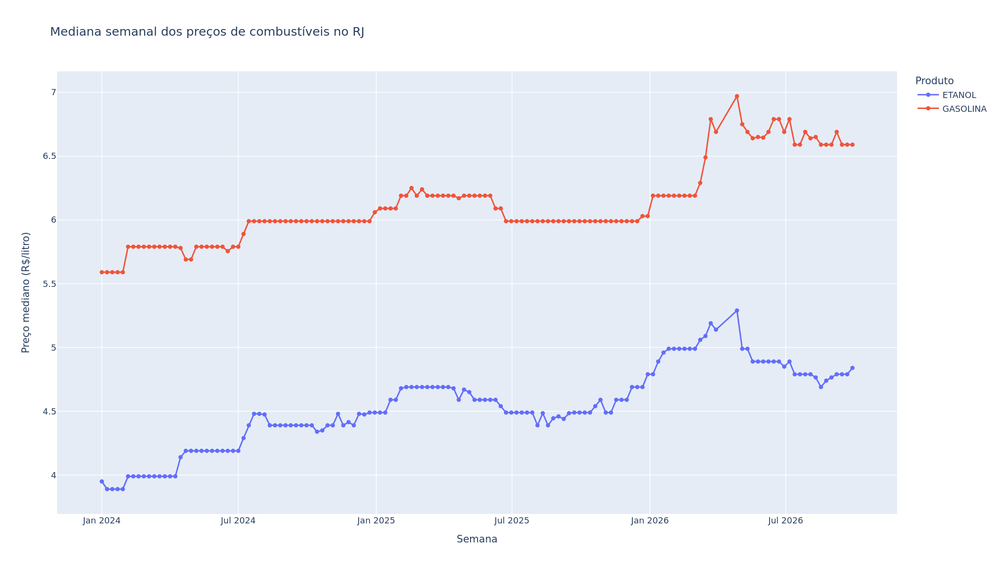
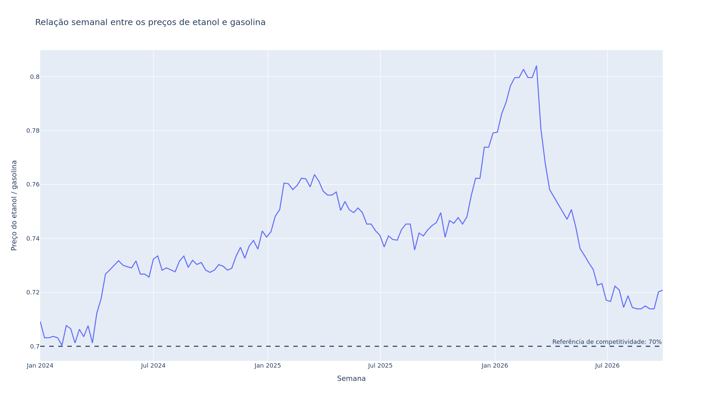
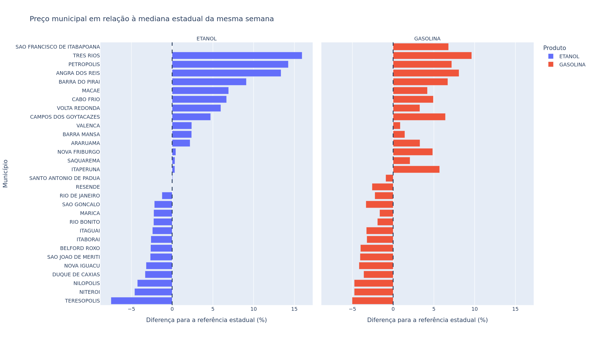
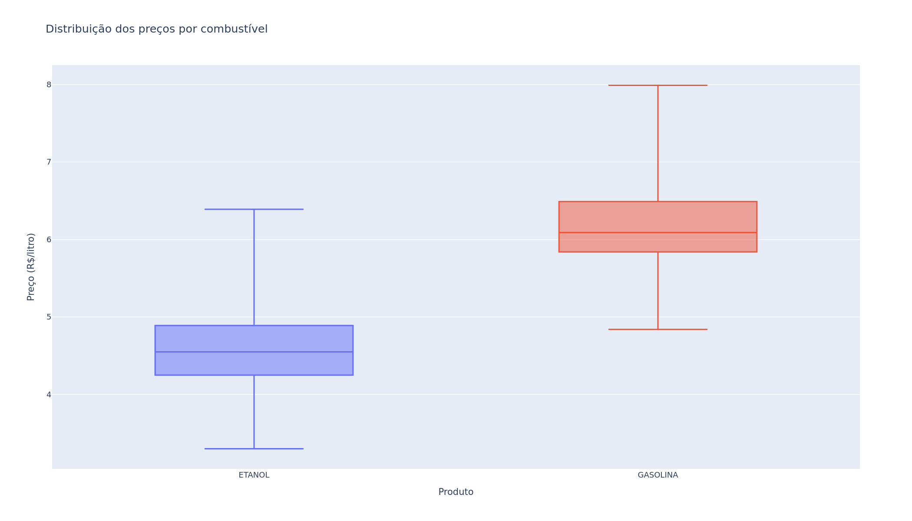

# Análise exploratória dos preços de combustíveis no RJ

## Objetivo

Esta análise investiga o comportamento dos preços de gasolina comum e etanol no estado do Rio de Janeiro, utilizando dados públicos da Agência Nacional do Petróleo, Gás Natural e Biocombustíveis (ANP).

A EDA busca responder:

1. Como os preços evoluíram ao longo do tempo?
2. Qual é a distribuição dos preços de cada combustível?
3. Quais municípios ficam tipicamente acima ou abaixo da referência estadual?
4. Em quais situações o etanol foi competitivo em relação à gasolina?
5. Existem valores extremos que precisam ser investigados?

## Base analisada

| Indicador | Resultado |
|---|---:|
| Registros processados | 83.441 |
| Postos distintos | 954 |
| Municípios | 32 |
| Início do período | 01/01/2024 |
| Final do período | 30/09/2026 |
| Registros de gasolina | 44.045 |
| Registros de etanol | 39.396 |

A base foi construída pelo pipeline de limpeza do projeto. Ela contém somente registros do estado do Rio de Janeiro, gasolina comum e etanol.

## Estatísticas descritivas

| Produto | Média | Mediana | Desvio-padrão | Mínimo | Q1 | Q3 | Máximo |
|---|---:|---:|---:|---:|---:|---:|---:|
| Etanol | R$ 4,55 | R$ 4,55 | R$ 0,42 | R$ 3,30 | R$ 4,25 | R$ 4,89 | R$ 6,39 |
| Gasolina | R$ 6,16 | R$ 6,09 | R$ 0,43 | R$ 4,84 | R$ 5,84 | R$ 6,49 | R$ 7,99 |

A proximidade entre média e mediana indica que as distribuições não apresentam assimetria extrema. Ainda assim, existem diferenças relevantes entre postos, municípios e períodos.

## Evolução temporal

A mediana semanal do etanol passou de R$ 3,95 no início da série para R$ 4,84 no final, uma variação nominal de 22,53%.

A mediana semanal da gasolina passou de R$ 5,59 para R$ 6,59, uma variação nominal de 17,89%.

O etanol apresentou crescimento proporcional maior que a gasolina. Esse movimento ajuda a explicar a redução de sua competitividade relativa ao longo do período.

Essas variações são nominais e não foram corrigidas pela inflação. Os valores da primeira e da última semana também podem ser influenciados pela quantidade de observações disponível nesses períodos.



## Competitividade do etanol

Foi utilizada como referência a regra prática segundo a qual o etanol é competitivo quando seu preço corresponde a, no máximo, 70% do preço da gasolina.

A comparação foi feita por município e semana, utilizando as medianas dos dois combustíveis.

| Indicador | Resultado |
|---|---:|
| Comparações município-semana | 3.557 |
| Comparações competitivas | 377 |
| Taxa de competitividade | 10,60% |
| Relação mediana etanol/gasolina | 73,73% |

Em aproximadamente 89,4% das comparações, o etanol ficou acima do limite de 70%. Sob essa regra geral, a gasolina foi economicamente mais vantajosa na maior parte das observações.

O limite de 70% é uma aproximação. A decisão real depende do consumo específico de cada veículo, das condições de uso e da eficiência energética dos combustíveis.



## Comparação ajustada entre municípios

Uma comparação simples das medianas de todo o período produziria um resultado enviesado. Teresópolis, por exemplo, possui observações somente até junho de 2024, enquanto outros municípios chegam a setembro de 2026.

Para reduzir esse problema, foi criado um índice ajustado:

1. calcula-se a mediana de cada município em cada semana;
2. calcula-se a mediana estadual das medianas municipais na mesma semana;
3. mede-se a diferença percentual entre o município e essa referência;
4. utiliza-se a mediana das diferenças semanais de cada município.

Esse procedimento controla parcialmente o efeito da evolução temporal e evita comparar diretamente preços coletados em períodos distintos.

### Etanol

- Teresópolis ficou tipicamente 7,50% abaixo da referência estadual nas semanas disponíveis.
- Três Rios ficou tipicamente 15,95% acima da referência estadual.

### Gasolina

- Teresópolis ficou tipicamente 5,03% abaixo da referência estadual nas semanas disponíveis.
- Três Rios ficou tipicamente 9,63% acima da referência estadual.

Esses resultados representam diferenças relativas durante as semanas observadas. Eles não significam que esses municípios sejam necessariamente os mais baratos ou caros na data atual.



## Valores potencialmente atípicos

Foi aplicado o critério do intervalo interquartil, utilizando limites de 1,5 vez o IQR.

| Produto | Limite inferior | Limite superior | Potenciais outliers | Percentual |
|---|---:|---:|---:|---:|
| Etanol | R$ 3,29 | R$ 5,85 | 24 | 0,06% |
| Gasolina | R$ 4,86 | R$ 7,47 | 136 | 0,31% |

Os valores foram mantidos na base. Ser estatisticamente atípico não significa ser incorreto: diferenças regionais, mudanças de mercado e estratégias comerciais podem produzir preços legítimos fora desses limites.

A remoção automática desses registros reduziria a capacidade da análise de representar situações reais do mercado.



## Principais conclusões

1. Os preços dos dois combustíveis aumentaram no período analisado.
2. O etanol apresentou crescimento nominal proporcionalmente maior que a gasolina.
3. A relação mediana entre etanol e gasolina foi de 73,73%.
4. Pelo critério de 70%, o etanol foi competitivo em apenas 10,60% das comparações município-semana.
5. Existem diferenças municipais persistentes mesmo após o ajuste pelo contexto semanal.
6. A quantidade de potenciais outliers é pequena e não justifica remoção automática.

## Limitações

- Os dados representam os postos pesquisados pela ANP, não necessariamente todos os postos existentes.
- A quantidade de observações varia entre municípios e períodos.
- Alguns municípios não possuem cobertura durante toda a série histórica.
- Os preços são nominais e não foram corrigidos pela inflação.
- A análise identifica associações e padrões, não relações causais.
- O critério de 70% para o etanol é uma referência geral e não considera o desempenho de cada veículo.
- Gasolina aditivada foi excluída do escopo para manter uma comparação mais homogênea.
- As semanas inicial e final podem estar parcialmente cobertas.

## Artefatos reproduzíveis

### Tabelas

- [`weekly_price_summary.csv`](weekly_price_summary.csv)
- [`municipality_price_summary.csv`](municipality_price_summary.csv)
- [`municipality_price_index.csv`](municipality_price_index.csv)
- [`ethanol_competitiveness.csv`](ethanol_competitiveness.csv)
- [`eda_summary.json`](eda_summary.json)

### Visualizações

- [`weekly_median_prices.png`](../figures/weekly_median_prices.png)
- [`price_distribution.png`](../figures/price_distribution.png)
- [`municipality_adjusted_price_index.png`](../figures/municipality_adjusted_price_index.png)
- [`ethanol_competitiveness.png`](../figures/ethanol_competitiveness.png)

Os arquivos HTML interativos também são gerados localmente, mas não são versionados.

## Reprodução

Execute a análise exploratória:

```bash
.venv/bin/python -m scripts.run_eda
```

Execute a validação completa:

```bash
.venv/bin/python -m pytest -q -W error
```